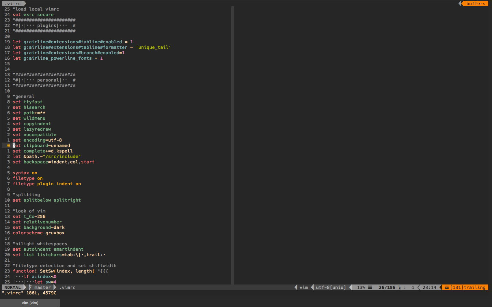

# Vim config

Nothing to fancy just my vim config.

## Installed Plugins

- [YouCompleteMe](https://github.com/Valloric/YouCompleteMe)
- [delimitMate](https://github.com/Raimondi/delimitMate)
- [nerdtree](https://github.com/scrooloose/nerdtree)
- [nerdcommenter](https://github.com/scrooloose/nerdcommenter)
- [ranger.vim](https://github.com/francoiscabrol/ranger.vim)
- [ultisnips](https://github.com/SirVer/ultisnips)
- [vim-snippets](https://github.com/honza/vim-snippets)
- [vim-devicons](https://github.com/ryanoasis/vim-devicons)
- [vim-nerdtree-syntax-highlight](https://github.com/tiagofumo/vim-nerdtree-syntax-highlight)
- [xterm-color-table](https://github.com/guns/xterm-color-table.vim.git)
- [CtrlP](https://github.com/ctrlpvim/ctrlp.vim.git)

## Look

